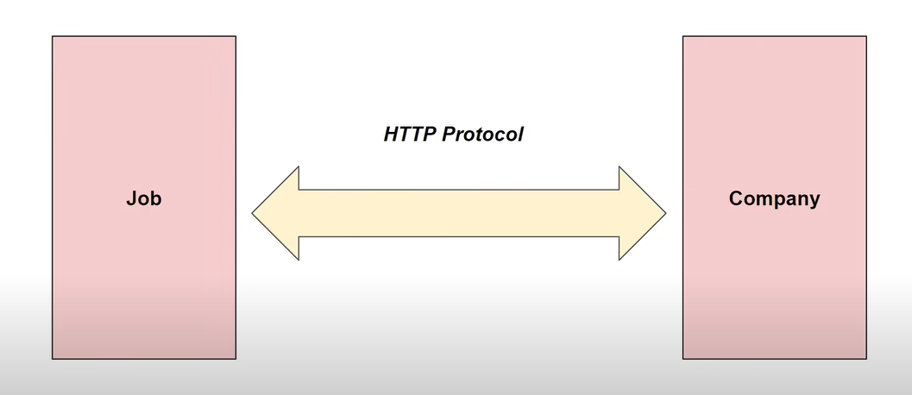

# MicroService: Resturcturing my Job Application from Monolithic architecture to MicroService.


## ``` How I am going to structure my three microservice ```


    I have 3 different microservice running on 3 different ports, We can see in the above image.

    These 3 microservices are going to 3 different springboot projects.

``` Why so? ```

    we are going to break down a single application which is in
    monolithic architecture into 3 different parts and they will
    be responsible for running as a single application. So for 
    the end user it will be like they are interacting a single
    application but in backend I have 3 different microservices
    running on 3 different ports

### ``` New review urls for microservice ```


    In my monolithic architecture my review urls is:- 
    
    [ GET /companies/{companyId}/reviews ] --> this url use path parameter
    mean's within the url path I had the companyId parameter.

    But in my microservice review urls are different:-

    Here I used Query parameter mean's passing the parameter in the form of
    query.
``` Query Parameter: It is a optional parameters in a URL that modify the behaviour of request ```  

    In new urls we can see I used [ GET /reviews?companyId={companyId} ]
    here review microservice companyId not a part of this ms that's
    why I accepted it as query parameter.

``` Path Parameter: When I pass a parameter in the path itself ```


    The reason behind resturcturing the urls is my microservices less to know about each other, need to be independent.

    
# ``` Inter-service communication: ```
    Here I have 3 microservices running on diffierent ports, use different database but for user or client these services should be running as a single unit.
    There is a need for these services to communicate with each others so they can
    function as a single unit. This is where we need [Inter-Service Communication].

``` What is Inter-Service Communication:- ```

    In simple term, It's a method through which microservices in an application communicate with each other.

    This communication between services can happen Synchronously and Asynchronously
    and we can use protocol like HTTP or Rest messaging

## ```Ways to implement ```
        |
        |---> 1. Synchronous Communication: It uses Synchronous request response      
        |        mechanism where the client wait for a reponse from the server       
        |         before proceeding and this can achived   through HTTP based protocols like rest
        |
        |---> 2. Asynchronous Communication: In this communication microservices can work Asynchronously and 
        |           they communicate with the help of message queues or message brokers like
        |           rabit mq, apache kafka, 
        |

# ```Rest Template ```

    It is a class in spring framework that simplifies the HTTP communication 
    between two microservices.

    Now I can use this for communicating between microservices and it does so 
    by abstracting the lower level detail into a very high level easy to use
    methods.

## ```Why do I we need Rest Template with microsevices ```

    Because, we will using it to interact between different microservices that we have.



    Let's say, I have Job microservice and compant microservice and if these two 
    microservice communicate with each other and sharing any data then we use 
    Rest Template and we will be using HTTP protocol by which we send the HTTP
    requests and handel HTTP responses.

# ```DTO Pattern ```

    DTO stands for: Data Transfer Object

``` It is a design pattern used to transfer data between software application subsystem.```

    With the help of DTO, I can retrive necessary data from microservice independently and I can map them to respestive
    DTO.

``` Example```


    In the above photo you see a company microservice and job microservice
    
    Now, let's say, to the user I wish to show the job Object as well as
    the company Object.
    
    Whenever, a user calls a Job API I wish to provide company information
    along with the job.

``` But How??```

    This can done by DTO [ Data Transfer Object ]

    Add DTO to application, and this DTO have object of both job and company classes
    and then this can be converted into response to the user.
``` So it gives better control to how I can manage what is being shown to user```

# ```What is Service Registry and Why do we need it in our MicroService Architechture ? ```

``` Service Registry:```  
    A service Registry is used in microservice architechture to enable dynamic service discovery

##  
    In microservices architecture Inter-Service communication is really importand and for Inter-Service communication
    we have hardcoded URLs that we can used communication but this is not a good practice.

    So, This Service Registry is a another approach  -


    The above picture we have service registry and other microservices (Compnayms, jobms, reviewms) 
    Now, What will heppens is every micro-service will register itself with service registry
    So we can say it's database that has been populated with the location of different microservices that exist
    so service registry will know all the microservices that exist in a architecture
    If we want to communicate with any microservice just go to service registry to get the location of that
    particular microservice and communicate with it.

### ```How Service Discovrey Process Works```


    Lets say I have 2 microservice Job-Microservice, Review-MicroService

``` 1. Register: ```  
        
        Job microservice will register itself with service registry that exist in the microservices architecture
        Now, whenever review microservice wishes to communicate with job service, review service go to service registry
        and do a Service Discovrey Process.

``` 2. Service Discovrey Process: ```  

        It's a request to cummunicate with to a particular service and then service registry will help the review service
        to cummunicate with job microservice.